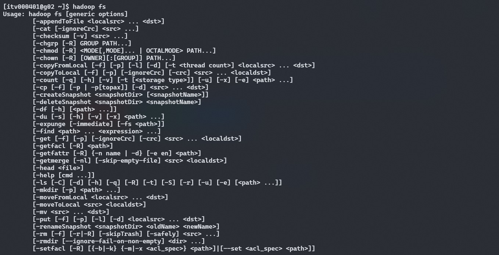
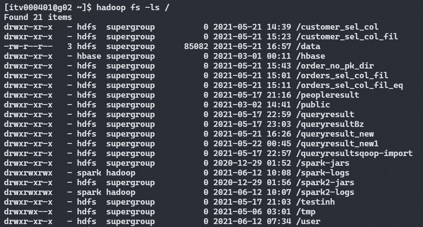
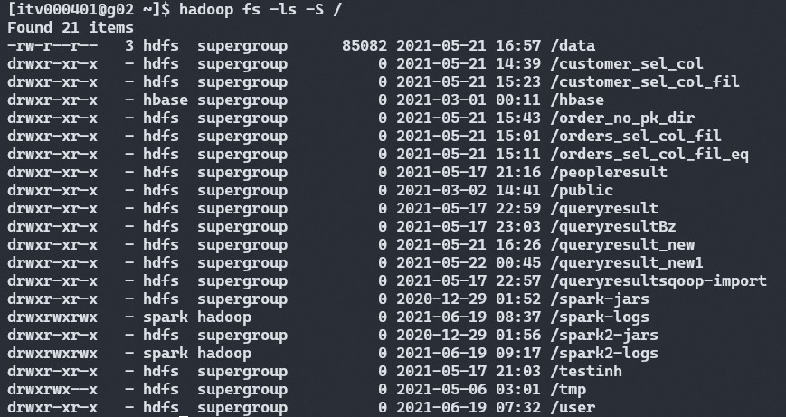
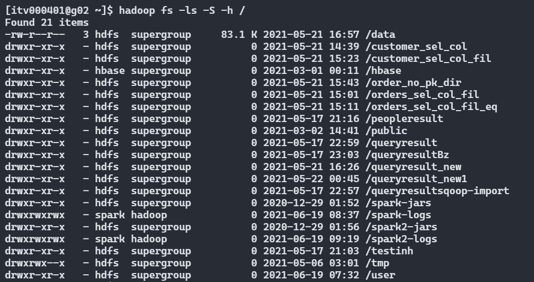

# **HDFS Commands**

A typical Hadoop cluster is nothing but a group of linux machines and interacting with the cluster is very similar to that of a linux machine. In case if you don't have any idea about linux commands follow the explainer below every command.

This is part of my [blog post](https://duckduckgo.com) on Hadoop Distributed FileSystem or HDFS where I've explained about the internals. Now we'll understand about it through commands. To simplify each linux command like ls, mkdir, rm, rmdir and etc. will be prefixed with `hadoop fs` or `hdfs dfs`

Here, I'm using [ITVersity](https://labs.itversity.com/) for all the practicals.

## 1. Lists all the HDFS commands

        hadoop fs

**Output:**

The output in the below image shows all the possible commands we can use. Ex: ls, mkdir, rm, rmdir and etc.

## 2. list all the files in the HDFS directory

1.      `hadoop fs -ls /`

`ls` is a basic command in linux which lists all the files, directories in a folder. Breaking down the above command:

1.`hadoop fs` - Prefix to the actual command

2.`-ls` - Actual command(linux command) which specifies what action to be performed.

3.`/` - Directory in HDFS. Here `\` means home folder and it is specific to `ls` command.

*Note:* The `ls` command will access the namespace (folder structure and hierarchy) directly from the NameNode.

**Output:**

2.      hadoop fs -ls -t -r /

This command has extra options `-t` and `-r`.

- `-t` - displays the results based on modified time. Files will be displayed with increasing order of their last modified time

- `-r` - displays the data in reverse order.

Both `-t` and `-r` along with `-ls` will display the files in the specified directory with lastest modified time first.

Below mentioned are some options we could use with `ls` to display the results in the way we need.

- `-S` - displays the files/folders according to the size. Largest file first. Ex:

        hadoop fs -ls -S /

The column before the date column shows the size of the data in KBs. To display the size in human redable format(like MBs and GBs) we need to use `-h` option as shown below. 

        hadoop fs -ls -S -h /

- To recursively list all the files and folders in the given path we will use `-R`

        hadoop fs -ls -R /

## 3. To search any file in a given HDFS path

        hadoop fs -ls <hdfs_path> | grep <search_term>

- Here we're getting the list of contents from a path in HDFS using `ls` and using pipe `|` we're passing the result to `grep` command. `grep` command will try to match the `<search_term>` in the list of files and folders it receives from `ls` command.

<!--- Add examples for grep command-->

- hadoop fs mkdir <dir_path>/folder_name
- hadoop fs mkdir -P <dir_path>/folder1/folder2

- hadoop fs -rm <dir_path>/folder1/file1.txt
- hadoop fs -rm -R <dir_path>/folder1/
- hadoop fs -rmdir <dir_path>/folder1

<!--- Copying files from local to hdfs-->
step1: hadoop fs -mkdir /data

step2: touch <local_path>/local_file.txt

step3: hadoop fs -copyFromLocal <local_path>/local_file.txt <hdfs_path>

(OR)

hadoop fs -put <local_path>/local_file.txt <hdfs_path>

<!--- Copying folders from local to hdfs-->
case 1: hadoop fs -copyFromLocal <local_path>/local_folder /data

case 1: hadoop fs -copyFromLocal <local_path>/local_folder /data/folder1

<!--- Copying folders from hdfs to local-->
hadoop fs -copyToLocal <hdfs_path> <local_path>
(OR)
hadoop fs -get <hdfs_path> <local_path>

<!--- To view first few lines of a file-->
hadoop fs -tail <hdfs_file_path>
hadoop fs -cat <hdfs_file_path> | more

<!--- Copy files from one location to other-->
hadoop fs -cp <hdfs_path_source> <hdfs_path_destination>

<!--- Move files from one location to other-->
hadoop fs -mv <hdfs_path_source> <hdfs_path_destination>

<!--- Check disk space -->
hadoop fs -df -h <hdfs_path> -> free disk space

hadoop fs -du -h <hdfs_path> -> disk space in use

hadoop fs -du -S -h <hdfs_path> -> summarize disk space

<!--- Change Replication factor -->
hadoop fs -Ddfs.replication=5 -put <local_path>/file1.csv <hdfs_path>

<!--- Get metadata in HDFS-->

hdfs fsck <hdfs_path> -files -blocks -locations
