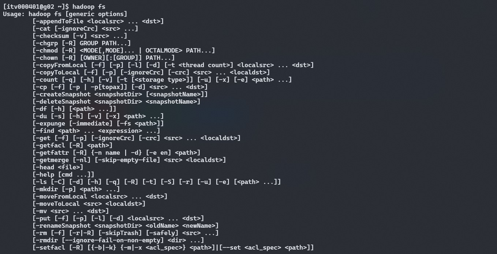
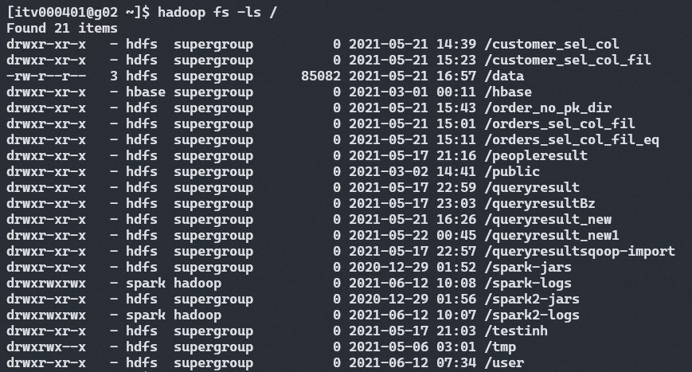

# **HDFS Commands**

A typical Hadoop cluster is nothing but a group of linux machines and interacting with the cluster is very similar to that of a linux machine. In case if you don't have any idea about linux commands follow the explainer below every command.

This is part of my [blog post](https://duckduckgo.com) on Hadoop Distributed FileSystem or HDFS where I've explained about the internals. Now we'll understand about it through commands. To simplify each linux command like ls, mkdir, rm, rmdir and etc. will be prefixed with `hadoop fs` or `hdfs dfs`

Here, I'm using [ITVersity](https://labs.itversity.com/) for all the practicals.

## 1. Lists all the HDFS commands

        hadoop fs

**Output:**

The output in the below image shows all the possible commands we can use. Ex: ls, mkdir, rm, rmdir and etc.

## 2. list all the files in the HDFS directory

1.      `hadoop fs -ls /`

`ls` is a basic command in linux which lists all the files, directories in a folder. Breaking down the above command:

1.`'hadoop fs'` - Prefix to the actual command

2.`'-ls'` - Actual command(linux command) which specifies what action to be performed.

3.`'/'` - Directory in HDFS. Here `\` means home folder and it is specific to `ls` command.

*Note:* The `ls` command will access the namespace (folder structure and hierarchy) directly from the NameNode.

**Output:**

2.      hadoop fs -ls -t -r /

This command has extra options `-t` and `-r`.

- `-t` - displays the results based on modified time. Files will be displayed with increasing order of their last modified time

- `-r` - displays the data in reverse order.

Both `-t` and `-r` along with `-ls` will display the files in the specified directory with lastest modified time first.
