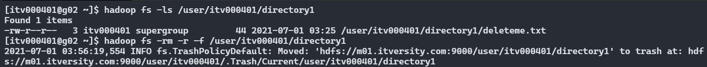

# **HDFS Commands**

A typical Hadoop cluster is nothing but a group of linux machines and interacting with the cluster is very similar to that of a linux machine. In case if you don't have any idea about linux commands follow the explainer below every command.

This is part of my [blog post](https://maninekkalapudi.com/hdfs-hadoop-distributed-filesystem) on Hadoop Distributed FileSystem or HDFS where I've explained about its internals. Now we'll understand about it through commands. To simplify each linux command like ls, mkdir, rm, rmdir and etc. will be prefixed with `hadoop fs` or `hdfs dfs`

Here, I'm using [ITVersity](https://labs.itversity.com/) for the Hadoop cluster. Lets dive in!

## 1. Lists all the HDFS commands

        hadoop fs

The output in the below image shows all the possible commands we can use. Ex: ls, mkdir, rm, rmdir and etc.

## 2. list all the files in the HDFS directory

1.      hadoop fs -ls <hdfs_path>

`ls` is a basic command in linux which lists all the files, directories in a given path. Breaking down the above command:

- `hadoop fs` - Prefix to the actual command. This will let us know that it is a command for HDFS cluster and not the linux machine.

- `-ls` - Actual command(linux command) which specifies what action to be performed.

- `<hdfs_path>` - Directory in HDFS.

*Note:* The `ls` command will access the namespace (directory structure and hierarchy) directly from the NameNode.

**Output:**

- Here `/` means home directory and `ls` command lists all the files in the home directory.

2.      hadoop fs -ls -t -r <hdfs_path>

- `-t` - displays the results based on modified time. Files will be displayed with increasing order of their last modified time

- `-r` - displays the data in reverse order.

Both `-t` and `-r` along with `-ls` will display the files in the specified directory with lastest modified time first.

Below mentioned are some options we could use with `ls` to display the results in the way we need.

3.        hadoop fs -ls -S <hdfs_path>

- `-S` option displays the files/directories according to the size. Largest file first

- The column before the date column shows the size of the data in KBs.

4.        hadoop fs -ls -S -h <hdfs_path>

`-h` option is used to display the size in human redable format(like KB, MB and GB etc.)

5.        hadoop fs -ls -R <hdfs_path>

`-R` option is used to recursively list all the files and directories in the given hdfs path

## 3. To search any file in a given HDFS path

        hadoop fs -ls <hdfs_path> | grep <search_term>

- Here we're getting the list of contents from a path in HDFS using `ls` and using `|` (pipe) we're passing the result to `grep` command. `grep` command will try to match the `<search_term>` in the list of files and directories it receives from `ls` command.

## 4. Create a directory in HDFS

1.        hadoop fs -mkdir <hdfs_path>/<directory_name>

- `-mkdir` command creates a new directory with the given name

*Note:* `<hdfs_path>` should be an existing path

- if `directory1` is not present in HDFS we'll get the following error for `-mkdir` command

2.        hadoop fs -mkdir -p <hdfs_path>/directory1/directory2

- `-p` option is used to create an empty directory structure at a given path

- Here, both `directory1` and `directory2` are newly created as mentioned in the above command

## 5. Remove a file, empty directory and a non-empty directory in HDFS

1.        hadoop fs -rm <dir_path>/<file_name>

- `-rm` command is used to remove a file from an HDFS path

*Note:*

Hadoop admin can set the behaviour for deleting files/directories. When we delete some data from the HDFS cluster either it is removed permanently or move the data to trash folder (`.Trash` folder in the above example).

2.        hadoop fs -rm -R <dir_path>/directory1/

- `-R` option is used along with `-rm` command to recursively remove the files in an HDFS directory

3.        hadoop fs -rmdir <dir_path>/directory1

- `-rmdir` command is used to remove an empty directory

4.        hadoop fs -rm -r -f <dir_path>/directory1

- `-rm` command along with `-r`, `-f` oprions is used to remove a directory along with its contents

## 6. Copying Files from Local Machine to HDFS

step1: Create a file in local machine. We can also use the files the are already in the local machine.

        touch <local_path>/<local_file_name> 

                (OR)
        
        echo <input_text> >> <file_name>

- `touch` command will create an empty file. `echo` command will print the whatever the input is given. Using `>>` we are passing the output of `echo` command to a new file (<file_name>)

step2: Create a directory in HDFS path

        hadoop fs -mkdir <hdfs_path>/<dir_name>

step3: Use `-copyFromLocal` or `-put` command to copy the file from local machine to HDFS

        hadoop fs -copyFromLocal <local_path>/<local_file_name> <hdfs_path>

                                (OR)

        hadoop fs -put <local_path>/<local_file_name> <hdfs_path>

- Copying Directories From Local Machine To HDFS

case 1:

        hadoop fs -copyFromLocal <local_path>/local_directory <hdfs_path>

- The `local_directory` will be copied to `<hdfs_path>`

case 2:

        hadoop fs -copyFromLocal <local_path>/local_directory <hdfs_path>/directory1

- The `local_directory` will be copied to `directory1` under the `<hdfs_path>`

## 7. Copying Directories From HDFS to Local

        hadoop fs -copyToLocal <hdfs_path> <local_path>

                                (OR)

        hadoop fs -get <hdfs_path> <local_path>

- `-copyToLocal`command or `-get` command is used to copy data from HDFS to local machine

## 8. To view contents of a file

1.        hadoop fs -tail <hdfs_file_path>

- `-tail` command will give the last few lines of a file.

2.        hadoop fs -cat <hdfs_file_path> | more

- `-cat` will give all the contents of the file.

- In the above command we are outputting the result of `-cat` command to `more` command using `|` (pipe). The `more` command will show first few lines of the file and rest of the file contents will be shown by pressing `return/enter` key.

## 9. Copy and Move Files From One HDFS Location To Other

1.        hadoop fs -cp <hdfs_path_source> <hdfs_path_destination>

- `-cp` command will be used to copy the files from one HDFS location to another.

*Note:* When we use the `-cp` command to copy the files, the data will be moved from one datanode to perform the copy operation. The NameNode will update the metadata for the files in the `<hdfs_path_destination>` location.

2.        hadoop fs -mv <hdfs_path_source> <hdfs_path_destination>

- `-mv` command will be used to move files from one location to another

*Note:* When we use the `-mv` command to move the files from `<hdfs_path_source>` to `<hdfs_path_destination>`, only the metadata in the NameNode will be updated for the files or directories. No data is moved between the data nodes

## 10. Check Disk Space Of The HDFS Cluster

1.        hadoop fs -df -h <hdfs_path>

- `-df` command will give the free space available in the cluster

2.        hadoop fs -du -h <hdfs_path>

- `-du` command will give the used space in the cluster

- The first column shows the actual size (raw size) of the files that users have placed in the various HDFS directories.

- The second column shows the actual space consumed by those files in HDFS.

3.        hadoop fs -du -s -h <hdfs_path>

- `-du -s` command summarizes the data data used by all the files in the path

## 11. Change Replication Factor For a File

        hadoop fs -Ddfs.replication=5 -put <local_path>/<file_name> <hdfs_path>

- `-D` represents that the command is altering the properties of the HDFS cluster

- In the above command, we are changing the replication factor for the individual file using `-Ddfs.replication=5`. The replication factor for each file will be shown in the second column of `ls` command's output.

## 12. Get Metadata in HDFS

        hdfs fsck <hdfs_path> -files -blocks -locations

- `hdfs fsck` command runs the filesystem check for the given path and reports the health of the data

## Sources

1. [hadoop disk space commands](https://www.informit.com/articles/article.aspx?p=2755708&seqNum=4)
