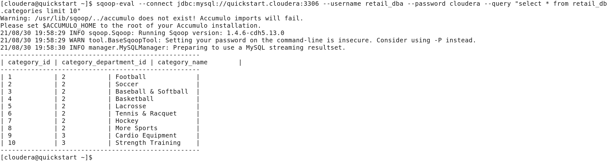

# **Sqoop Commands**

Sqoop offers commands to import, export, eval and other commands to connect to any database (MySQL) and transfer data to and from HDFS and the database. The following examples are demonstrated on Cloudera quickstart VM 5.13 on a Windows machine.

## **1. Accessing MySQL databases using Sqoop**
### **a. List all databases**

    sqoop-list-databases --connect jdbc:mysql://<db-hostname>:<db-port> --username <username> --password <password>

    sqoop-list-databases --connect jdbc:mysql://quickstart.cloudera:3306 --username retail_dba --password cloudera

### **Output**

**Note:** In the blog post, the databases which are meant to be used internally by different tools like Hive (metastore) and etc. are listed and those are ignored by Sqoop and others are displayed.

### **b. List all tables in a database**

    sqoop-list-tables --connect jdbc:mysql://<db-hostname>:<db-port>/<db-name> --username <username> --password <password>

    sqoop-list-tables --connect jdbc:mysql://quickstart.cloudera:3306/retail_db --username retail_dba --password cloudera

### **Output**

### **c. Eval- run an adhoc query to check the output from the table**

    sqoop-eval --connect jdbc:mysql://<db-hostname>:<db-port> --username <username> --password <password> --query "<sql-query>"

    sqoop-eval --connect jdbc:mysql://quickstart.cloudera:3306 --username retail_dba --password cloudera --query "select * from retail_db.customers limit 10"

### **Output**

## **2. Sqoop Import Commands**

